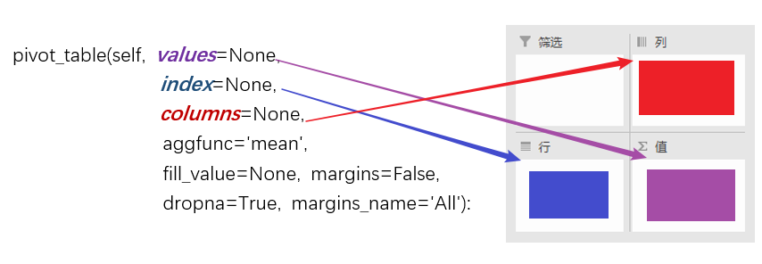

# Notes

记录开发过程的一些问题和心得


## 透视表

最近才真正接触Exxcel透视表的功能，在进行数据处理的时候，利用透视表对数据进行聚合处理非常的高效。所以如果能自动产生根据需求的透视表，那么可以节省很多时间。

在python中使用强大的pandas来实现对数据的透视表处理。在pandas中提供了接口**pivot_table**

## Pandas

可以阅览[pandas官网](http://pandas.pydata.org/)查看更详细的信息(包含[pdf](http://117.128.6.31/cache/pandas.pydata.org/pandas-docs/stable/pandas.pdf?ich_args2=461-27115917036847_a9bbaaf53a84f3a0e6a84f629d176d3f_10001002_9c89612ad4c0f6d49e39518939a83798_061bfaaa0f142965b5714397065536a6))。

### pivot_table

* 在官方对**pivot_table**的介绍

  ```text
  The function pivot_table() can be used to create spreadsheet-style pivot tables. See the cookbook for some
  advanced strategies.
  It takes a number of arguments:
  • data: a DataFrame object.
  • values: a column or a list of columns to aggregate.
  • index: a column, Grouper, array which has the same length as data, or list of them. Keys to group by on the
  pivot table index. If an array is passed, it is being used as the same manner as column values.
  • columns: a column, Grouper, array which has the same length as data, or list of them. Keys to group by on
  the pivot table column. If an array is passed, it is being used as the same manner as column values.
  • aggfunc: function to use for aggregation, defaulting to numpy.mean.
  ```

  


## Excel

## 创建excel

[xlwt官方网址](https://xlwt.readthedocs.io/en/latest/index.html)  
使用xlwt来创建一个新的excel文件，整理操作函数感觉比较简单，复杂的应该是在对单元格的业务操作上。所以先来看看主要接口有哪些

* 创建excel  
    file = xlwt.Workbook()

* 添加sheet  
    sheet = file.add_sheet()  

* 添加sheet  
    [官方说明](https://xlwt.readthedocs.io/en/latest/api.html?highlight=write)  
    sheet = write(r, c, label='', style=<xlwt.Style.XFStyle object>)  


### 合并单元格的处理

#### 读取

由于对excel单元格的处理，遇到合并的情况时候，默认只会读取第一个cell的内容，其余的cell会返回空值。那么如何区分这个单元格本身就是空值，还是由于合并后返回的空值呢？

* 获取合并单元格信息

  **formatting_info**  
  
  > xlrd.open_workbook(r'demo.xlsx',formatting_info=True)  
  > sheet = workbook.sheet_by_name('sheet')  
  > sheet.merged_cells  
  
 
  打开文件时，设置formatting_info为True，默认为False。通过**merged_cells**

## REF

[Pandas Pivot Table Explained](https://pbpython.com/pandas-pivot-table-explained.html)
