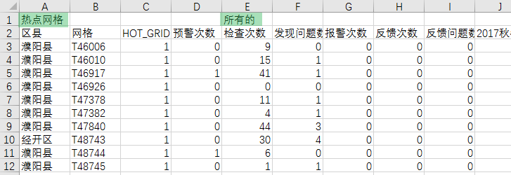
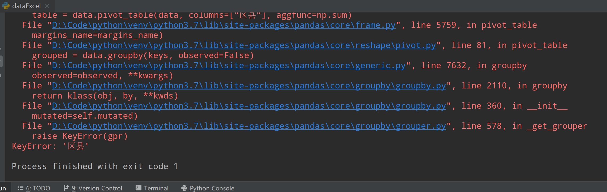
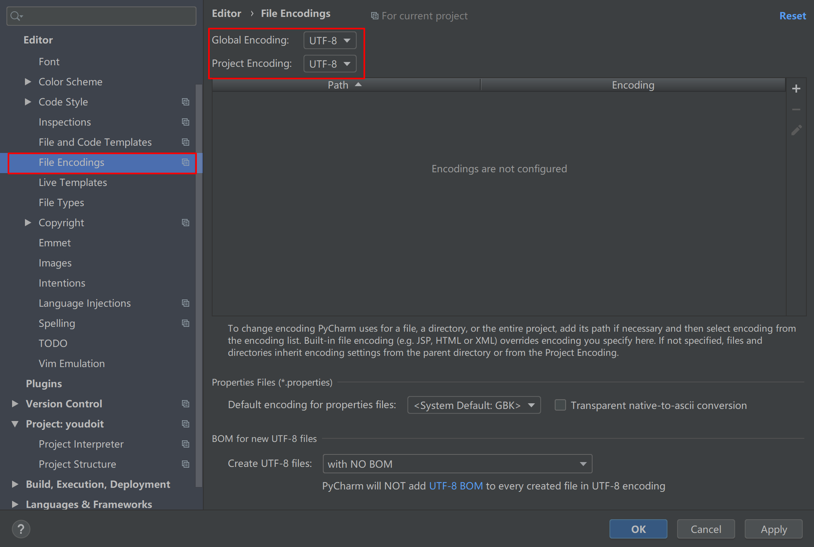

# Q&A

##Notice

* 原始csv数据

  在处理原始csv数据的时候，注意行标签的处理，例如下图中行中包含了"热点网络"和"所有的"。  
在处理数据的时候会带来干扰。

  
  
  csv文件如上图中的内容显示，那么在运行的时候会出现下面的错误
  
 
 
* Pycharm Setting Encoding

在File -> Settings -> Editor -> File Encodings

  
